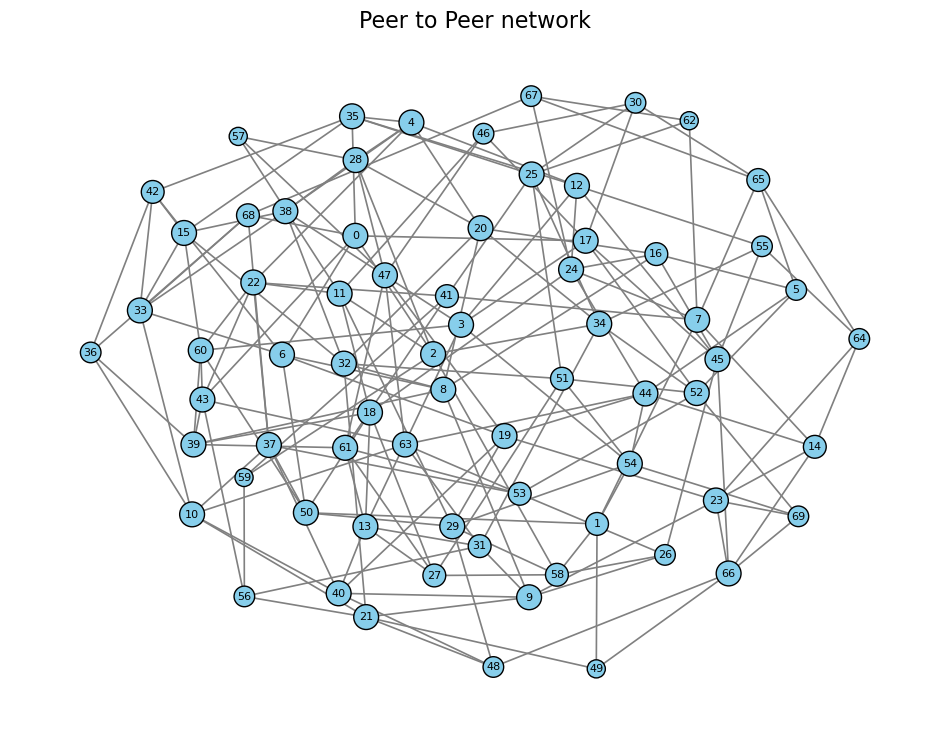

# Blockchain Arena - Assignment 1: P2P Network Simulation
## Overview

This project implements a basic Peer-to-Peer (P2P) network structure for the **Blockchain Arena** course assignment. The simulation randomly generates a connected undirected network of peers, with each peer having 3 to 6 connections. The graph is visualized using Python's `networkx` and `matplotlib` libraries.

The network satisfies:
- Number of peers: Random between 50 and 100
- Each peer connects to 3–6 other peers
- The network is fully connected (a path exists between any two nodes)

## Features

- Randomized P2P graph generation
- Degree constraints on each peer
- Connectivity validation using BFS and NetworkX tools
- Visualization using Kamada-Kawai layout
- Graph saved as `network.png`

## Dependencies

Ensure you have Python installed along with the following libraries:

```bash
pip install matplotlib networkx
```
## Output

Below is the visualization of a generated valid P2P network:


# TLDR
For the following assignment the viewer can simply walkthrough to P2P_generator.ipynb to see how code works
Or just to regenerate network.png the generator.py file can be run . The code uses following libraries so make sure to have them :
- matplotlib
- networkx
- time,random,queue included in std libraries 
- It uses python3